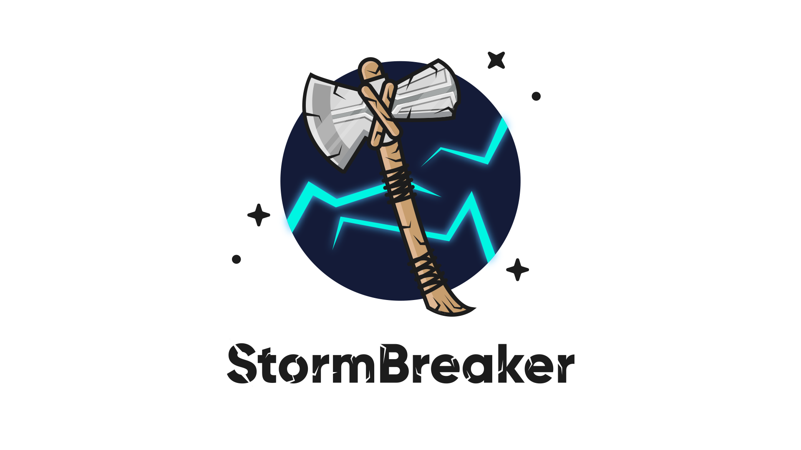

<h1 align="center">
  <br>
  <a href="https://github.com/whobcode/Nytebr8ker"></a>
</h1>

<h4 align="center">A Tool With Attractive Capabilities. </h4>

<p align="center">
  <a href="http://python.org">
    
  </a>
  <a href="https://php.net">
    
  </a>
  <a href="https://en.wikipedia.org/wiki/Linux">
    
  </a>
  <a href="#https-support">
    
  </a>
</p>


### Features:

- Obtain Device Information Without Any Permission !
- Access Location [SMARTPHONES]

---

## ⚙️ Updated Setup Notes (2025)

This project now uses a fully modular and production-ready environment:

- 🐘 PHP server managed by `stormctl.py`
- 🌐 Self-hosted NGINX reverse proxy
- 🌩️ Optional Cloudflare Tunnel (`cloudflared`) support
- 🔐 NGINX config auto-generated and linked to Bitnami paths
- 🧠 CLI control via menu-based loop

For full setup, see `stormctl.py` or run:

```bash
python3 ~/Nytebr8ker/bin/stormctl.py
```

---

## 🧰 Installation Instructions

### 1. Clone the repository:
```bash
cd
git clone https://github.com/whobcode/Nytebr8ker.git
cd Nytebr8ker
```

### 2. Install Python dependencies:
```bash
pip install -r requirements.txt
```

### 3. Install PHP and Bitnami NGINX (or make sure they’re installed):
```bash
sudo apt install php php-cli php-fpm
# Bitnami stack should be installed in /opt/bitnami/
```

### 4. (Optional) Install Cloudflared:
```bash
wget https://github.com/cloudflare/cloudflared/releases/latest/download/cloudflared-linux-amd64.deb
sudo dpkg -i cloudflared-linux-amd64.deb
```

### 5. Make stormctl executable:
```bash
chmod +x ~/Nytebr8ker/bin/stormctl.py
sudo ln -s ~/Nytebr8ker/bin/stormctl.py /usr/local/bin/stormctl
```

---

Run the tool:
```bash
sudo python3 ~/Nytebr8ker/bin/stormctl.py
```

---

## 🔐 HTTPS Builds and Bitnami NGINX Integration

This project is designed to integrate with Bitnami’s NGINX stack for secure and scalable deployment.

### 📁 NGINX Configuration Path
The reverse proxy configuration is written to:
```
/opt/Storm-breaker/conf/myapp-nginx.conf
```
And symlinked to:
```
/opt/bitnami/nginx/conf/bitnami/myapp.conf
```

### ⚙️ Enable HTTPS with Bitnami bncert-tool
To secure your deployment with HTTPS:
```bash
sudo /opt/bitnami/bncert-tool
```
Follow the interactive prompts to:
- Add your domain
- Request Let's Encrypt SSL cert
- Auto-configure HTTPS

This automatically updates your Bitnami NGINX with SSL certificates and redirects.

### 🛡️ Sample HTTPS Config Snippet
Once HTTPS is enabled, your config may resemble:
```nginx
server {
    listen 443 ssl;
    server_name yourdomain.com;

    ssl_certificate /opt/bitnami/nginx/conf/certs/server.crt;
    ssl_certificate_key /opt/bitnami/nginx/conf/certs/server.key;

    root /home/hwmnbn/Nytebr8ker/storm-web;
    index index.php index.html;

    location / {
        try_files $uri $uri/ /index.php?$args;
    }

    location ~ \.php$ {
        include fastcgi_params;
        fastcgi_pass 127.0.0.1:PORT;
        fastcgi_index index.php;
        fastcgi_param SCRIPT_FILENAME $document_root$fastcgi_script_name;
    }
}
```

⚠️ Replace `PORT` with your chosen or randomly assigned port managed by `stormctl.py`.

### 🔧 Alternative: HTTPS with Certbot (Non-Bitnami)
If you're not using Bitnami and installed NGINX manually, use Certbot:

#### Install Certbot and NGINX plugin:
```bash
sudo apt install certbot python3-certbot-nginx
```

#### Request and apply certificate:
```bash
sudo certbot --nginx -d yourdomain.com
```

Certbot will automatically update your `/etc/nginx/sites-available/default` or custom config and reload NGINX.

To renew automatically, a systemd timer or cron job is installed:
```bash
sudo certbot renew --dry-run
```

📝 Remember: Open ports 80 and 443 in your firewall for domain validation and HTTPS traffic.

---

## 🖥️ stormctl CLI Usage Cheat Sheet

Start the main controller:
```bash
python3 ~/Nytebr8ker/bin/stormctl.py
```

Menu options:
```
[1] Start server on custom port
[2] Start server on random port
[3] Stop server
[4] Check server status
[5] Check for updates
[6] Start NGINX
[7] Stop NGINX
[8] Configure NGINX Reverse Proxy
[9] Restart NGINX
[10] Start Cloudflare Tunnel (Optional)
[0] Exit
```

Output logs available at:
```
~/Nytebr8ker/logs/stormctl.log
```

---

